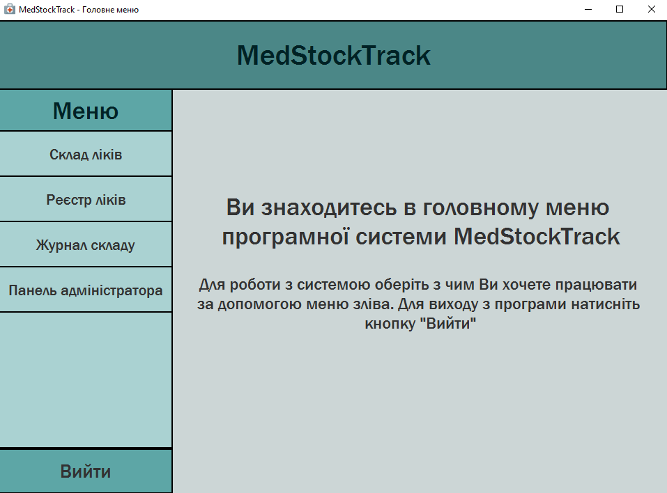
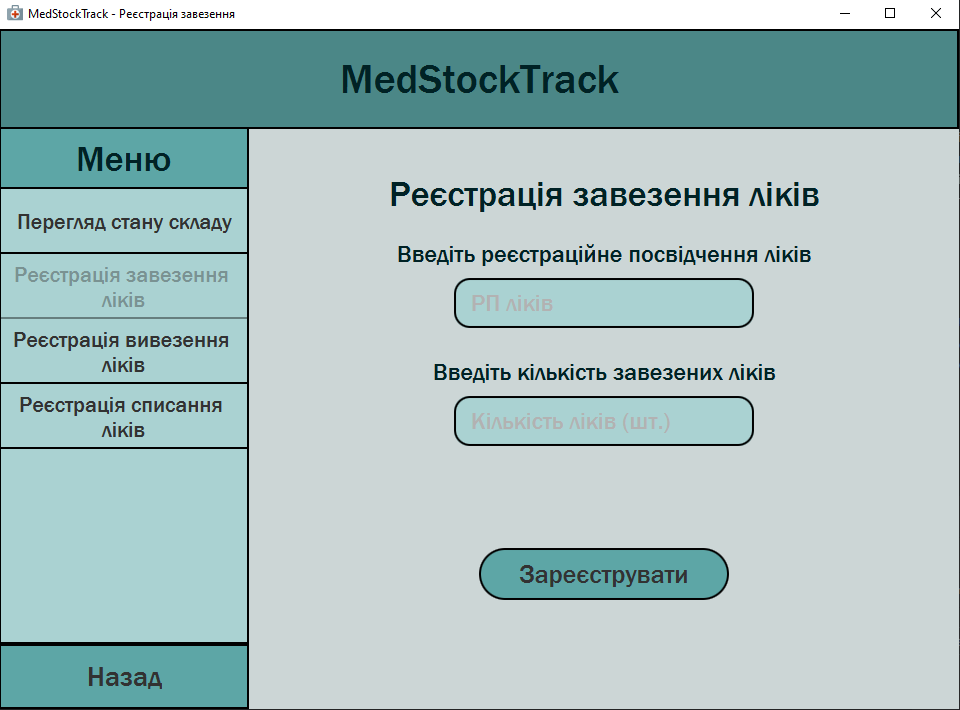
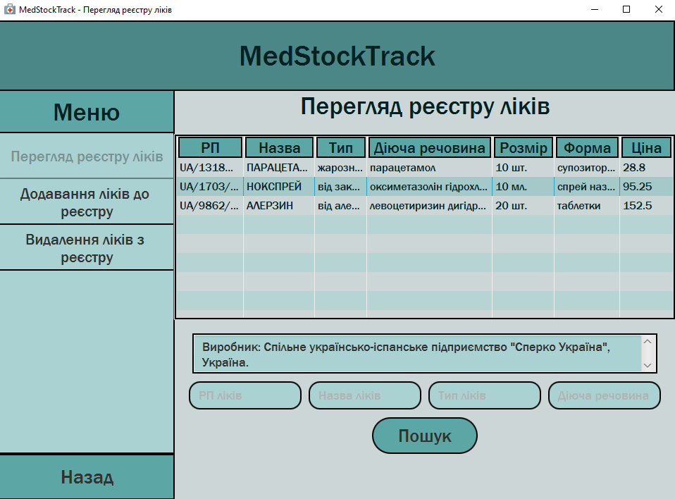
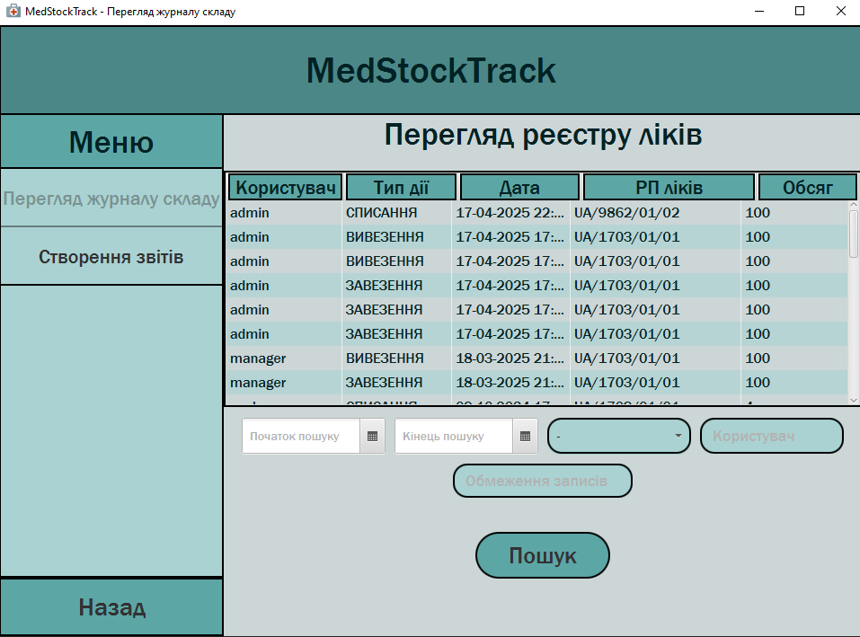

# MedStockTrack

## About project
MedStockTrack is a software system for medicine accounting.
Main functions include: managing storage information (add/remove medicine, view current medicine stock);
managing medicine register (register new medicine, remove medicine from register, view full medicine list);
viewing warehouse activity and making reports; creating new users and editing existing users, changing their roles, etc.

## Used technologies
Main programming language is Java. User interface created using JavaFX, SceneBuilder, FXML and CSS.
For data storage I used MySQL Workbench database. System was tested using JUnit framework.
For dependency management I used Maven.

## Screenshots

  
  

  
  

